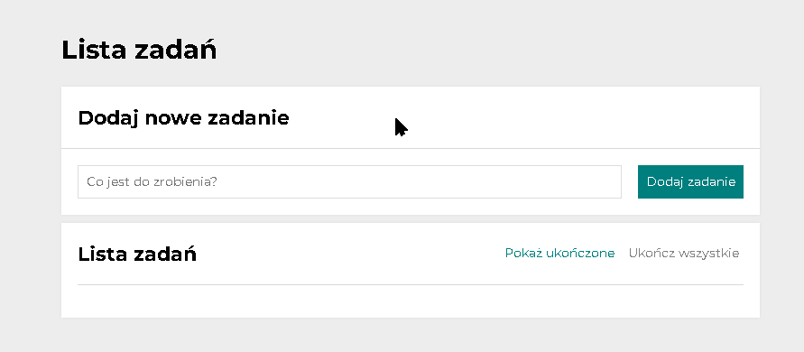

 # Hello everyone !😊😁😀 
 ---
 ## I'd like to give you a simple "what to do list". It can also be used as a shopping list, etc.
 ## On the list, we can add things that we want to do of course, we can mark them as done or remove them from the list.
 # Check my 👉👉👉[To-Do-List!](https://picioo.github.io/to-do-list/)!
 ---

 # How it's working?

---
---

 ## Technologies used:
- HTML
- JavaScript
- CSS
- BEM convention
- Normalize
- GIT
- Grid
- Flex

